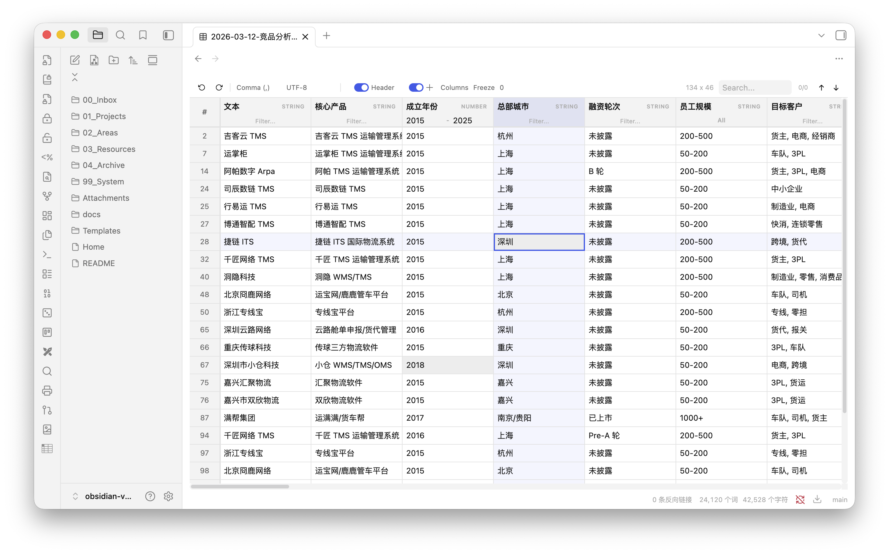

# Tablite

A fast, feature-rich CSV/TSV editor for [Obsidian](https://obsidian.md). Edit tabular data directly in your vault with an Excel-like experience.

[中文文档](README_zh.md)



## Features

- **Virtual scrolling & progressive loading** — handles large files smoothly with chunked rendering
- **Inline editing** — double-click any cell to edit
- **Cell selection & cross highlight** — single-click to select, with row/column cross highlight (toggleable)
- **Column type detection** — auto-detects STRING, NUMBER, DATE types per column
- **Column sorting** — click header to sort (multi-column supported)
- **Smart column filtering**
  - Text columns: free-text filter
  - Enum columns (< 12 unique values): multi-select dropdown with checkboxes
  - Number columns: min/max range filter
  - Date columns: date range picker
- **Global search** — search across all cells with highlight and navigation
- **Auto delimiter detection** — comma, semicolon, tab, pipe
- **Excel export compatibility** — auto-trims trailing empty columns from bloated spreadsheet exports
- **Auto encoding detection** — UTF-8, GBK, Windows-1252, Shift-JIS
- **Header detection** — auto-detects whether first row is a header, with manual toggle
- **Column management** — hide/show, reorder via drag & drop, freeze columns
- **Column resizing** — drag column borders to resize
- **Persistent column config** — column widths, order, visibility, and freeze state are saved per file
- **Context menu** — right-click to insert/delete rows and columns
- **Undo/Redo** — full edit history (up to 50 steps)
- **Obsidian-native styling** — respects your theme colors and dark/light mode

## Installation

### Manual Installation

1. Download `tablite-x.x.x.zip` from the [latest release](https://github.com/laofahai/obsidian-tablite/releases)
2. Extract the zip into `<vault>/.obsidian/plugins/`
3. Restart Obsidian and enable **Tablite** in Settings → Community Plugins

## Usage

Open any `.csv` or `.tsv` file in your vault — Tablite automatically opens it as an editable table.

| Action | How |
|---|---|
| Edit a cell | Double-click |
| Select a cell | Single-click |
| Sort column | Click header name (multi-sort with Shift+click) |
| Rename header | Double-click header name |
| Filter column | Use the filter input below header (type varies by column) |
| Resize column | Drag the right edge of header |
| Reorder columns | Drag & drop column headers |
| Hide/show columns | Use the Columns panel in toolbar |
| Freeze columns | Set freeze count in toolbar |
| Insert/delete row or column | Right-click → context menu |
| Undo / Redo | `Ctrl/Cmd+Z` / `Ctrl/Cmd+Shift+Z` |
| Search | `Ctrl/Cmd+F` or search box in toolbar |

## Tech Stack

- [Preact](https://preactjs.com/) — lightweight UI
- [TanStack Table](https://tanstack.com/table) — headless table logic (sorting, filtering)
- [TanStack Virtual](https://tanstack.com/virtual) — row virtualization
- [PapaParse](https://www.papaparse.com/) — CSV parsing/serialization
- [jschardet](https://github.com/nicstredicern/jschardet) — encoding detection

## Development

```bash
git clone https://github.com/laofahai/obsidian-tablite.git
cd obsidian-tablite
npm install
npm run dev    # watch mode
npm run build  # production build
```

## License

MIT
