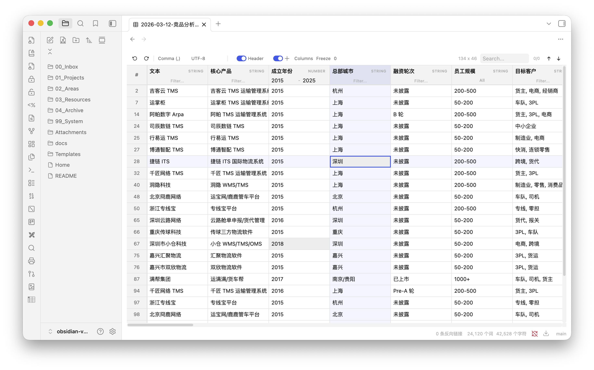

# Tablite

一个快速、功能丰富的 Obsidian CSV/TSV 编辑器，在库中直接编辑表格数据，体验类似 Excel。

[English](README.md)



## 功能

- **虚拟滚动 + 分段渲染** — 大文件分批加载，首屏即时呈现
- **单元格编辑** — 双击即可编辑
- **选中与十字高亮** — 单击选中单元格，行列十字高亮（可开关）
- **列类型自动检测** — 自动识别 STRING、NUMBER、DATE 类型
- **列排序** — 点击表头排序（支持多列排序）
- **智能列筛选**
  - 文本列：自由文本过滤
  - 枚举列（唯一值 < 12）：多选下拉框，支持勾选多个值
  - 数字列：最小/最大范围过滤
  - 日期列：日期范围选择器
- **全局搜索** — 全表搜索并高亮匹配，支持上下导航
- **自动分隔符检测** — 逗号、分号、制表符、竖线
- **兼容 Excel 导出** — 自动裁剪 Excel 导出时产生的大量尾部空列
- **自动编码检测** — UTF-8（含/不含 BOM）、GBK、Windows-1252、Shift-JIS、UTF-16
- **保存时保持原编码** — 编辑后按文件自身编码写回（GBK 文件仍是 GBK，Excel 打开不会乱码）。在工具栏选择编码会立即把文件转换成该编码，表格里显示的内容不会变化；旁边的 ↻ 按钮用于按所选编码重新读取磁盘文件，修正检测错误的文件。新建文件使用「设置 → Tablite」中的默认编码。
- **表头检测** — 自动识别首行是否为表头，支持手动切换
- **列管理** — 隐藏/显示、拖拽排序、冻结列
- **列宽调整** — 拖拽列边框调整宽度
- **列配置持久化** — 每个文件的列宽、顺序、可见性、冻结状态自动保存
- **右键菜单** — 插入、删除行列
- **撤销重做** — 最多 50 步历史记录
- **原生主题适配** — 自动适配当前主题和明暗模式

## 安装

### 社区插件

在 Obsidian 设置 → 社区插件 → 浏览 中搜索 **Tablite**。

### 通过 BRAT 安装

1. 安装 [BRAT](https://github.com/TfTHacker/obsidian42-brat) 插件
2. 在 BRAT 设置中选择 **Add Beta Plugin**
3. 输入 `laofahai/obsidian-tablite`

### 手动安装

1. 从 [最新发布](https://github.com/laofahai/obsidian-tablite/releases/latest) 下载 `main.js`、`manifest.json` 和 `styles.css`
2. 放入 `<vault>/.obsidian/plugins/tablite/` 目录
3. 重启 Obsidian，在设置 → 社区插件中启用 **Tablite**

## 使用

在库中打开任意 `.csv` 或 `.tsv` 文件，Tablite 会自动以可编辑表格打开。

在「设置 → Tablite」中设置新建文件的默认编码。Obsidian 1.13+ 也可通过全局设置搜索
找到该选项；旧版本继续使用原设置页，最低支持 Obsidian 1.5.0。

| 操作 | 方式 |
|---|---|
| 编辑单元格 | 双击 |
| 选中单元格 | 单击 |
| 排序 | 点击表头（Shift+点击多列排序） |
| 重命名表头 | 双击表头 |
| 列筛选 | 在表头下方使用对应类型的过滤控件 |
| 调整列宽 | 拖拽表头右边缘 |
| 拖拽排列列 | 拖放列表头 |
| 隐藏/显示列 | 使用工具栏的 Columns 面板 |
| 冻结列 | 在工具栏设置冻结列数 |
| 增删行列 | 右键菜单 |
| 撤销 / 重做 | `Ctrl/Cmd+Z` / `Ctrl/Cmd+Shift+Z` |
| 搜索 | `Ctrl/Cmd+F` 或工具栏搜索框 |

## 技术栈

- [Preact](https://preactjs.com/) — 轻量 UI 框架
- [TanStack Table](https://tanstack.com/table) — 表格排序筛选
- [TanStack Virtual](https://tanstack.com/virtual) — 行虚拟化
- [PapaParse](https://www.papaparse.com/) — CSV 解析
- [jschardet](https://github.com/nicstredicern/jschardet) — 编码检测

## 开发

```bash
git clone https://github.com/laofahai/obsidian-tablite.git
cd obsidian-tablite
npm ci
npm run dev    # 开发模式
npm run lint   # 官方 Obsidian 规则，要求零警告
npx tsc --noEmit
npm test
npm run build  # 生产构建
```

仓库开发规则见 [AGENTS.md](AGENTS.md)，验证及发布跟进步骤见
[CONTRIBUTING.md](CONTRIBUTING.md)。发布后，维护者需在 Obsidian Community 插件后台
点击 **Check for new releases**，等新版本扫描完成后再报告
[评分卡](https://community.obsidian.md/plugins/tablite#scorecard)结果。

## 隐私与权限

Tablite 通过 Obsidian Vault API 读写你打开的 CSV/TSV 文件。复制操作会把选中单元格
写入系统剪贴板；插件不读取剪贴板，也不上传表格内容。内置 CSV 解析库包含网络下载
实现，但 Tablite 只向解析器传入本地文本，未启用下载功能。点击单元格中的链接会打开
对应地址。

## 许可

MIT
